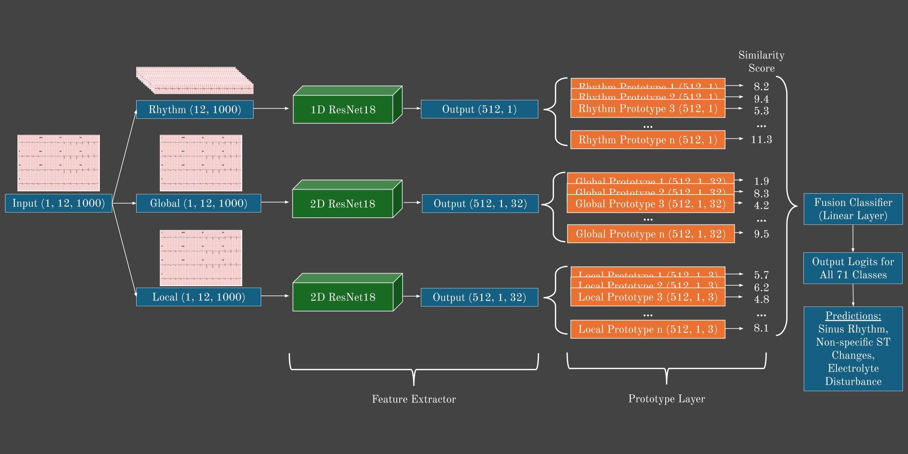
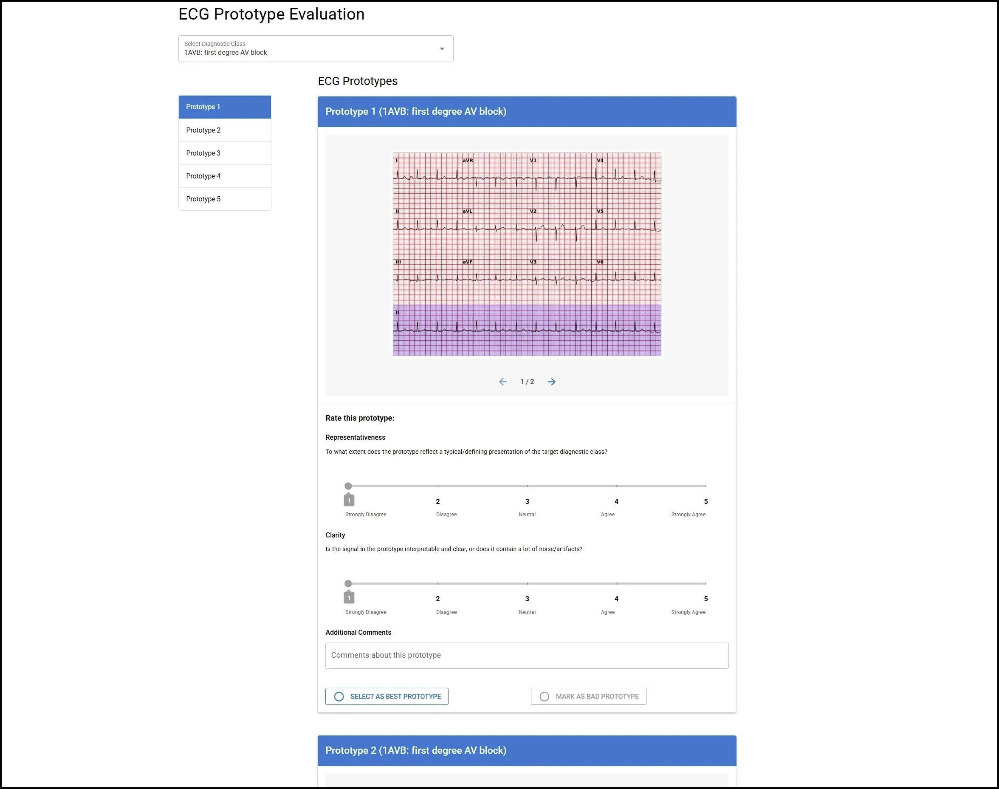

# ProtoECGNet

*Note: The official version of this repo has been moved [here](https://github.com/bbj-lab/protoecgnet). This one may be out of date.*

The ProtoECGNet architecture is shown below:


## Installation

Requirements:

- `python==3.10`

```bash
git clone https://github.com/bbj-lab/protoecgnet.git
cd protoecgnet
conda env create -f environment.yml --name ecg_env
conda activate ecg_env
```

## Accessing the Data
Please install PTB-XL directly from PhysioNet [`here`](https://physionet.org/content/ptb-xl/1.0.3/). 

## Using the Repo with PTB-XL
- In [`ecg_utils.py`](https://github.com/bbj-lab/bbj_ecg/blob/main/src/ecg_utils.py), update ```DATASET_PATH``` to where you installed the dataset, update the ```STANDARDIZATION_PATH``` directory (where you want to save preprocessing results), and save [`scp_statementsRegrouped2.csv`](https://github.com/bbj-lab/protoecgnet/blob/main/scp_statementsRegrouped2.csv) within the ```DATASET_PATH``` directory

## Training
 - Below is an example python command for training a model
 - You can choose to train on any of the dataset groupings from the original PTB-XL paper (i.e., "superdiagnostic", "subdiagnostic", "diagnostic", "form", "rhythm", "all") by simply passing that string into ```args.label_set```, but ensure ```args.custom_groups``` is set to False
 - If you want to train with the custom groupings from our paper, set ```args.custom_groups``` to True and pass in either 1, 3, or 4 for ```args.label_set``` depending on which label grouping you want to use
   - 1=1D rhythm (use ```args.proto_time_len```=32)
   - 3=2D local morphology (use ```args.proto_time_len```=3)
   - 4=2D global (use ```args.proto_time_len```=32)
   - [`scp_statementsRegrouped2.csv`](https://github.com/bbj-lab/protoecgnet/blob/main/scp_statementsRegrouped2.csv) contains the groupings
 - Note that you need to pre-compute the label co-occurrence matrices, then update their file paths for each label set in [`proto_models1D.py`](https://github.com/bbj-lab/protoecgnet/blob/main/src/proto_models1D.py) and [`proto_models2D.py`](https://github.com/bbj-lab/protoecgnet/blob/main/src/proto_models2D.py):
   - In [`label_co.py`](https://github.com/bbj-lab/protoecgnet/blob/main/src/label_co.py), update ```label_set``` in the ```get_dataloaders()``` call based on the same value you are planning to use when training your model
   - Also update the ```save_path``` to be appropriate for that label set
   - Then, simply run ```python label_co.py``` in the terminal
 - Update "training_stage" as desired: 
    - "feature_extractor" trains a normal 1D or 2D ResNet (the remaining stages initialize a ProtoECGNet)
    - "prototypes" freezes the feature extractor and classifier, and only trains the prototype (and add-on) layers, so you need to use the ```pretrained_weights``` argument to provide weights to a pre-trained feature extractor
    - "joint" trains everything except the classifier
    - "classifier" trains a branch-specific classifier
    - "fusion" trains a fusion classifier, but you need to go in and manually update the arguments in [`src/main.py`](https://github.com/bbj-lab/protoecgnet/blob/main/src/main.py) (paths to model weights for each branch, number of prototypes per branch, backbone type per branch, etc.)
    - "projection" does not train the model—it instead performs prototype projection
  - Training notes:
    - Make sure to always do "projection" before training a classifier (whether doing the branch-specific "classifier" stage or the multi-branch "fusion" stage) to ensure prototypes are grounded in real training ECGs
    - There are several ways to train models, including pre-training the ResNet backbone with the "feature_extractor" phase then passing those weights into the ```args.pretrained_weights``` argument when doing the "joint" phase
    - You can also do multiple rounds of "joint" followed by "projection" each time before doing "classifier" or "fusion" if needed to improve performance
    - You can also try freezing the ResNet backbone and only training the prototypes with the "prototypes" stage
    - It is also encouraged to experiment with additional backbones (we focused on only ResNets to minimize variables and isolate the effect of our multi-branch architecture and contrastive loss)
    - If using additional backbones, for at least the 2D partial prototype morphology branch, ensure the latent feature map preserves the spatial relationship of the input (for the partial prototypes to correctly correspond to localized time segments)
    - You can see how we adapted ResNet 1D and 2D to work with our architecture in [`src/backbones.py`](https://github.com/bbj-lab/protoecgnet/blob/main/src/backbones.py)
 - Inference is automatically done after training (excluding when training_stage = "projection"; after projection, train a branch-specific or fusion classifier before doing inference), and results are logged to TensorBoard and an output CSV
   - You can also bypass training and just do inference if you set ```args.test_model```=True and specify the model weights using ```args.pretrained_weights```
 - All training progress is logged to TensorBoard
 - Descriptions of each input argument can be found in [`src/main.py`](https://github.com/bbj-lab/protoecgnet/blob/main/src/main.py)

```bash
python3 main.py \
    --job_name "2D_morphology_train1" \
    --epochs 200 \
    --batch_size 32 \
    --lr 0.0001 \
    --checkpoint_dir "/path/to/experiments/checkpoints" \
    --log_dir "/path/to/experiments/logs" \
    --save_top_k 3 \
    --patience 10 \
    --resume_checkpoint False \
    --training_stage "joint" \
    --dimension "2D" \
    --backbone "resnet18" \
    --single_class_prototype_per_class 18 \
    --joint_prototypes_per_border 0 \
    --sampling_rate 100 \
    --label_set "3" \
    --save_weights True \
    --seed 42 \
    --num_workers 4 \
    --dropout 0.35 \
    --l2 0.00017 \
    --scheduler_type "CosineAnnealingLR" \
    --custom_groups True \
    --proto_time_len 3 \
    --proto_dim 512 \
    --pretrained_weights "/path/to/pretrained_weights.ckpt"
```


## Tuning
 - Below is an example python command for running a hyperparameter tuning sweep.
 - Adjust the search space directly in [`src/tune.py`](https://github.com/bbj-lab/protoecgnet/blob/main/src/tune.py) as desired (most of the arguments below won't be changed)
 - Descriptions of each input argument can be found in [`src/tune.py`](https://github.com/bbj-lab/protoecgnet/blob/main/src/tune.py)

```bash
python tune.py \
    --job_name 2D_morphology_tune1 \
    --epochs 200 \
    --n_trials 200 \
    --batch_size 32 \
    --checkpoint_dir /path/to/experiments/checkpoints \
    --log_dir /path/to/experiments/logs \
    --test_dir /path/to/experiments/test_results \
    --study_dir /path/to/experiments/optuna_studies \
    --sampling_rate 100 \
    --label_set "3" \
    --num_workers 4 \
    --dimension "2D" \
    --seed 42 \
    --training_stage "joint" \
    --custom_groups True \
    --proto_dim 512 \
    --proto_time_len 3 \
    --backbone resnet18
```

## Inference and Case-Based Explanations
 - Use [`src/inference_fusion.py`](https://github.com/bbj-lab/protoecgnet/blob/main/src/inference_fusion.py) to run inference on the full test set using the fusion classifier
   - Make sure to update all the paths/values in the top of the file
   - It will determine what classes are predicted for each test ECG, and also determine what the top activated prototypes are for each predicted diagnosis using all three branches
   - Example command: ```python inference_fusion.py --show-prototypes --sanity-check --save-results```
 - Use [`src/case_explanations.ipynb`](https://github.com/bbj-lab/protoecgnet/blob/main/src/case_explanations.ipynb) for case-based explanations

## Additional Notes
 - We recommend 5-10 prototypes per branch for category 1 (1D global prototypes), 15-20 for category 3 (2D partial prototypes), and 3-8 for category 4 (2D global prototypes)
    - You can easily hyperparameter tune this in `tune.py`
    - Similarly, you may be able to further optimize the loss coefficients, but we set default values that work well in `main.py` and `tune.py`
 - The commands above are for directly running the files
 - [`scripts/`](https://github.com/bbj-lab/protoecgnet/tree/main/scripts) contains the shell scripts used to submit jobs to SLURM if using an HPC

 - To view TensorBoard logs, after activating your conda environment (with TensorBoard installed), do:
   ```tensorboard --logdir=/path/to/logdir/job_name --port 6006```
    - Replace ```'path/to/logdir/'``` with the actual path, and make sure to update it in the relevant parts of the repo
    - Use the ```'job_name'``` from when you began training/tuning
    - Then, either access ```http://localhost:6006``` in your browser
    - Or if on an HPC, ssh into the computer with a new terminal tab ```ssh -L 6006:localhost:6006 myaccount@example_computer.edu```, then access ```http://localhost:6006``` in your browser
    - You can use a different port (6006 is chosen as an example)
 - You can directly visualize all the prototypes using the TensorBoard logs, or save the images directly by setting ```save_val``` to True and specifying a ```save_dir``` in ```log_ecg_to_tensorboard_1d``` and ```log_ecg_to_tensorboard_2d``` in ```push.py```
 - If you are interested in visualizing test ECGs and prototype activations, you can use the ```plot_ecg()``` function in ```ecg_utils.py``` and adapt the highlighting logic from ```log_ecg_to_tensorboard_2d``` in ```push.py``` to inference as needed

## Developers
   - Model/Training/Tuning Repo: [Sahil Sethi](https://github.com/sahilsethi0105)
     - This is an original codebase but contains some elements heavily inspired by [ProtoPMed-EEG](https://github.com/chengstark/ProtoPMed-EEG), [TesNet](https://github.com/JackeyWang96/TesNet), & [ProtoPNet](https://github.com/cfchen-duke/ProtoPNet)
     - We developed our approach as an extension of the above papers
   - User Interface (see below): [David Chen](https://github.com/sudoris)



## Citation

Please cite our paper below: 

```bibtex
@misc{sethi2025protoecgnetcasebasedinterpretabledeep,
      title={ProtoECGNet: Case-Based Interpretable Deep Learning for Multi-Label ECG Classification with Contrastive Learning}, 
      author={Sahil Sethi and David Chen and Thomas Statchen and Michael C. Burkhart and Nipun Bhandari and Bashar Ramadan and Brett Beaulieu-Jones},
      year={2025},
      eprint={2504.08713},
      archivePrefix={arXiv},
      primaryClass={cs.LG},
      url={https://arxiv.org/abs/2504.08713}, 
}
```
